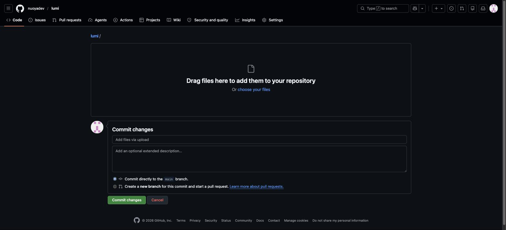

<div align="center">




# Lumi — AI Social Media Autopilot

[](LICENSE)
[](https://python.org)
[](https://playwright.dev)
[](https://anthropic.com)
[]()
[]()

> **Post on Twitter/X & Instagram automatically. No API fees. No manual work. Just results.**
> >
> >> Built by [@nuoyadev](https://github.com/nuoyadev) — Because building is more important than posting about building.
> >>
> >> </div>

---

## 🦈 What is Lumi?

**Lumi** is an AI-powered social media autopilot that runs silently in the background and posts for you — every single day — while you focus on what actually matters: building.

It uses **LLMs (Claude / GPT-4)** to generate platform-native content from your ideas, projects, and GitHub activity, then uses **Playwright** to post directly via the browser — completely **free**, no API keys required for posting.

```
Your projects → Lumi AI → Twitter/X post ✓
                        → Instagram caption ✓
                        → Scheduled & done ✓
```

---

## ✨ Features

| Feature | Description |
|---|---|
| 🤖 **AI Content Generation** | Claude or GPT-4 generates engaging posts from your GitHub activity |
| 🌐 **Browser-Based Posting** | Playwright posts via browser — zero API cost for Twitter/Instagram |
| ⏰ **Smart Scheduling** | GitHub Actions runs on cron — fully automated, 24/7 |
| 🎯 **Platform-Native** | Different tone & format for Twitter vs Instagram |
| 🔄 **Multi-Platform** | Twitter/X + Instagram in one pipeline |
| 🛡️ **Safe & Private** | No third-party services, runs entirely in your GitHub repo |

---

## 🏗️ Architecture

```
┌─────────────────────────────────────────────────────────┐
│                    LUMI PIPELINE                        │
│                                                         │
│  GitHub Actions (cron)                                  │
│         ↓                                               │
│  content_generator.py                                   │
│    ├── Fetch GitHub activity / topic ideas              │
│    ├── Call Claude API → generate tweet draft           │
│    └── Call Claude API → generate Instagram caption     │
│         ↓                                               │
│  poster/                                                │
│    ├── twitter_poster.py (Playwright)                   │
│    │     → Login → Compose → Post                       │
│    └── instagram_poster.py (Playwright)                 │
│          → Login → New post → Caption → Publish         │
│         ↓                                               │
│  scheduler.py                                           │
│    └── Orchestrates timing, retries, logging            │
└─────────────────────────────────────────────────────────┘
```

**Stack:**
- **Python 3.10+** — core language
- - **Playwright (async)** — browser automation for posting
  - - **Claude API / OpenAI API** — LLM content generation
    - - **GitHub Actions** — free scheduling & CI/CD
      - - **YAML config** — per-platform tone and style settings
       
        - ---

        ## 🚀 Quick Start

        ### 1. Clone the repo

        ```bash
        git clone https://github.com/nuoyadev/lumi.git
        cd lumi
        ```

        ### 2. Install dependencies

        ```bash
        pip install -r requirements.txt
        playwright install chromium
        ```

        ### 3. Configure environment

        ```bash
        cp .env.example .env
        # Edit .env with your credentials
        ```

        ```env
        # LLM (pick one)
        ANTHROPIC_API_KEY=sk-ant-...
        OPENAI_API_KEY=sk-...

        # Social accounts (stored securely as GitHub Secrets)
        TWITTER_EMAIL=your@email.com
        TWITTER_PASSWORD=yourpassword
        TWITTER_USERNAME=@yourhandle

        INSTAGRAM_EMAIL=your@email.com
        INSTAGRAM_PASSWORD=yourpassword
        ```

        ### 4. Run locally

        ```bash
        python lumi.py --platform twitter --dry-run
        python lumi.py --platform instagram --dry-run
        python lumi.py --all  # post to all platforms
        ```

        ### 5. Deploy with GitHub Actions

        Add your secrets to the repo (`Settings → Secrets`) and the workflow runs automatically:

        ```yaml
        # .github/workflows/lumi.yml (auto-generated)
        on:
          schedule:
            - cron: '0 9 * * *'  # Every day at 9am UTC
        ```

        ---

        ## 📁 Project Structure

        ```
        lumi/
        ├── lumi.py                    # Main entry point
        ├── content_generator.py       # LLM content generation
        ├── scheduler.py               # Orchestration & timing
        ├── poster/
        │   ├── twitter_poster.py      # Twitter/X Playwright bot
        │   └── instagram_poster.py    # Instagram Playwright bot
        ├── config/
        │   ├── platforms.yaml         # Per-platform settings
        │   └── prompts.yaml           # LLM prompt templates
        ├── .github/
        │   └── workflows/
        │       └── lumi.yml           # GitHub Actions workflow
        ├── CLAUDE.md                  # AI instructions for Cursor
        ├── requirements.txt
        ├── .env.example
        └── README.md
        ```

        ---

        ## 🗺️ Roadmap

        - [x] Project setup & architecture
        - [ ] - [x] CLAUDE.md instructions for AI-assisted development
        - [ ] - [ ] `content_generator.py` — LLM integration (Claude + GPT-4)
        - [ ] - [ ] `twitter_poster.py` — Playwright Twitter automation
        - [ ] - [ ] `instagram_poster.py` — Playwright Instagram automation
        - [ ] - [ ] `scheduler.py` — orchestration logic
        - [ ] - [ ] GitHub Actions workflow
        - [ ] - [ ] Config system (YAML)
        - [ ] - [ ] Dry-run mode
        - [ ] - [ ] Multi-account support
        - [ ] - [ ] Analytics dashboard
       
        - [ ] ---
       
        - [ ] ## 🤝 Contributing
       
        - [ ] This project is built in public. PRs, issues, and ideas are welcome.
       
        - [ ] 1. Fork the repo
        - [ ] 2. Create your branch (`git checkout -b feat/your-feature`)
        - [ ] 3. Commit your changes (`git commit -m 'feat: add your feature'`)
        - [ ] 4. Push and open a PR
       
        - [ ] ---
       
        - [ ] ## 📄 License
       
        - [ ] MIT © [nuoyadev](https://github.com/nuoyadev)
       
        - [ ] ---
       
        - [ ] <div align="center">

        **Lumi** — Post while you build. Zero API cost.

        

        </div>
